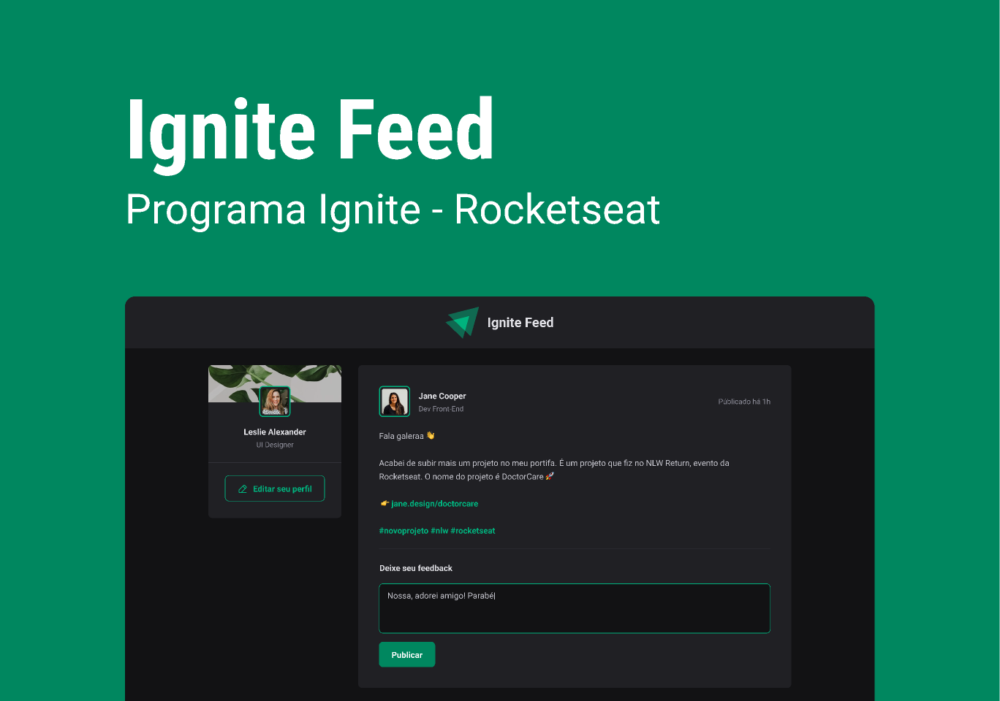

# Fundamentos do React

* Projeto de estudo desenvolvido para aprender os fundamentos do React.

Veja o projeto online: [Ignite feed](https://main--celebrated-cat-2b89b7.netlify.app/)

Projeto no [Figma](https://www.figma.com/community/file/1113573231685349036)

